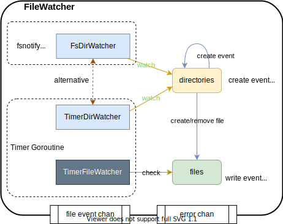

# the design of file watch

## Background

I'd like to automatically operate all these files with a given suffix in a directory and all sub-directories.
These files not being updated for a long time should be excluded, 
but need to be included if them being updated in a later time.

## Features
- recursively list all file with given suffix in directory/sub-directories.
- send event when file created in directory/sub-directories.
- send event when file being inactive/silence.

## Design


- **directories**: directory/sub-directories being watched.
- **files**: all active/inactive files, not include deleted or silence files.
- **file event channel**: channel for file events, include create, write, remove, inactive, and silence.
- **error channel**: channel for watch error.
- **FsDirWatcher**: a watcher to watch file create/remove events using [fsnotify](https://github.com/vogo/fsnotify).
- **TimerDirWatcher**: a watcher periodically to scan files under directories.
- **TimerFileWatcher**: a watcher periodically to read and compare the stat of files to judge whether file is created/removed/inactive/silence.
- **Timer Goroutine**: using one goroutine to run directory and file watcher.

## Usage

```go
// method: `fs` or `timer`, `fs` uses `fsnotify` to watch file create/remove events,
//    while `timer` periodically reads and compares the stat of files to judge whether file is created/removed/inactive/silence.
// inactive duration: a file is considered to be inactive if it's not being updated in the given duration.
// silence duration: a file is considered to be silence and removed from watching files if it's not being updated in the given duration.
fileWatcher, err := fwatch.New(method, inactiveDuration, silenceDuration)
if err != nil {
    fmt.Println(err)
	return
}

go func() {
	for {
		select {
		case <-fileWatcher.Stopper.C:
			return
		case f := <-fileWatcher.Events:
			fmt.Printf("--> events : %s, %v", f.Name, f.Event)
		}
	}
}()

// only watch log files.
matcher := func(s string) bool {
    return strings.HasSuffix(s, ".log")
}

if err = fileWatcher.WatchDir(tempDir, true, matcher); err != nil {
	fmt.Println(err)
	return
}
```
