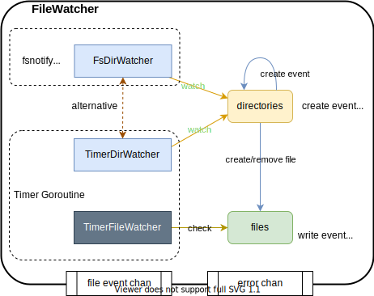

# fwatch

A Go library for watching file changes in directories with lifecycle management.

fwatch tracks files by suffix in a directory tree, sends events on creation and modification,
and automatically marks files as **inactive** or **silence** based on configurable time thresholds.

## Features

- Recursive directory and sub-directory watching
- File filtering by custom matcher (e.g. suffix-based)
- Two watch methods: OS-level `fs` (fsnotify) or polling `timer`
- File lifecycle events: `Create`, `Write`, `Remove`, `Inactive`, `Silence`
- Symlink and hard link support
- Configurable directory file count limit
- Dynamic `UnwatchDir` and runtime `Stats`

## Install

```sh
go get github.com/vogo/fwatch
```

## Usage

```go
package main

import (
	"fmt"
	"strings"
	"time"

	"github.com/vogo/fwatch"
)

func main() {
	// Create a watcher with functional options.
	watcher, err := fwatch.New(
		fwatch.WithMethod(fwatch.WatchMethodFS),       // or WatchMethodTimer (default)
		fwatch.WithInactiveDuration(30*time.Second),   // file considered inactive after 30s
		fwatch.WithSilenceDuration(5*time.Minute),     // file removed from watch after 5m
		fwatch.WithDirFileCountLimit(256),             // skip dirs with >256 files
	)
	if err != nil {
		panic(err)
	}
	defer watcher.Stop()

	// Consume events in a goroutine.
	go func() {
		for {
			select {
			case <-watcher.Done():
				return
			case ev := <-watcher.Events:
				fmt.Printf("event: %s %v\n", ev.Name, ev.Event)
			case err := <-watcher.Errors:
				fmt.Printf("error: %v\n", err)
			}
		}
	}()

	// Watch a directory (recursive), only matching .log files.
	err = watcher.WatchDir("/var/log/app", true, func(name string) bool {
		return strings.HasSuffix(name, ".log")
	})
	if err != nil {
		panic(err)
	}

	// Query runtime stats.
	stats := watcher.Stats()
	fmt.Printf("watching %d dirs, %d files (%d active)\n", stats.Dirs, stats.Files, stats.ActiveFiles)

	// Dynamically stop watching a directory.
	watcher.UnwatchDir("/var/log/app")

	select {}
}
```

## Options

| Option | Description | Default |
|--------|-------------|---------|
| `WithMethod(m)` | Watch method: `WatchMethodFS` or `WatchMethodTimer` | `WatchMethodTimer` |
| `WithInactiveDuration(d)` | Duration after which an unchanged file is marked inactive | `1s` |
| `WithSilenceDuration(d)` | Duration after which an unchanged file is removed from watch | `2s` |
| `WithDirFileCountLimit(n)` | Max files per directory (32-1024), skip dirs exceeding this | `128` |

## Watch Methods

| Method | Constant | How it works |
|--------|----------|-------------|
| **fs** | `WatchMethodFS` | Uses [fsnotify](https://github.com/fsnotify/fsnotify) for OS-level file system notifications |
| **timer** | `WatchMethodTimer` | Periodically polls file stat to detect changes |

## Event Types

| Event | Description |
|-------|-------------|
| `Create` | A new file is detected in the watched directory |
| `Write` | An inactive file is modified again |
| `Remove` | A file is deleted or moved away |
| `Inactive` | A file has not been updated for `inactiveDuration` |
| `Silence` | A file has not been updated for `silenceDuration`, removed from watch list |

## Architecture



| Component | Description |
|-----------|-------------|
| **directories** | Watched directory tree |
| **files** | Active and inactive files (excludes deleted/silence) |
| **Events channel** | File lifecycle events |
| **Errors channel** | Watch errors |
| **FsDirWatcher** | OS-level directory watcher via fsnotify |
| **TimerDirWatcher** | Periodic directory scanner |
| **TimerFileWatcher** | Periodic file stat checker for lifecycle transitions |

## CLI Tools

Two command-line tools are included under `cmd/`:

```sh
# Watch a directory for file changes
go run ./cmd/fwatch -dir /path/to/watch -method fs -include_sub -suffix .log

# Watch a single file
go run ./cmd/fswatch -f /path/to/file
```

## License

Apache License 2.0
